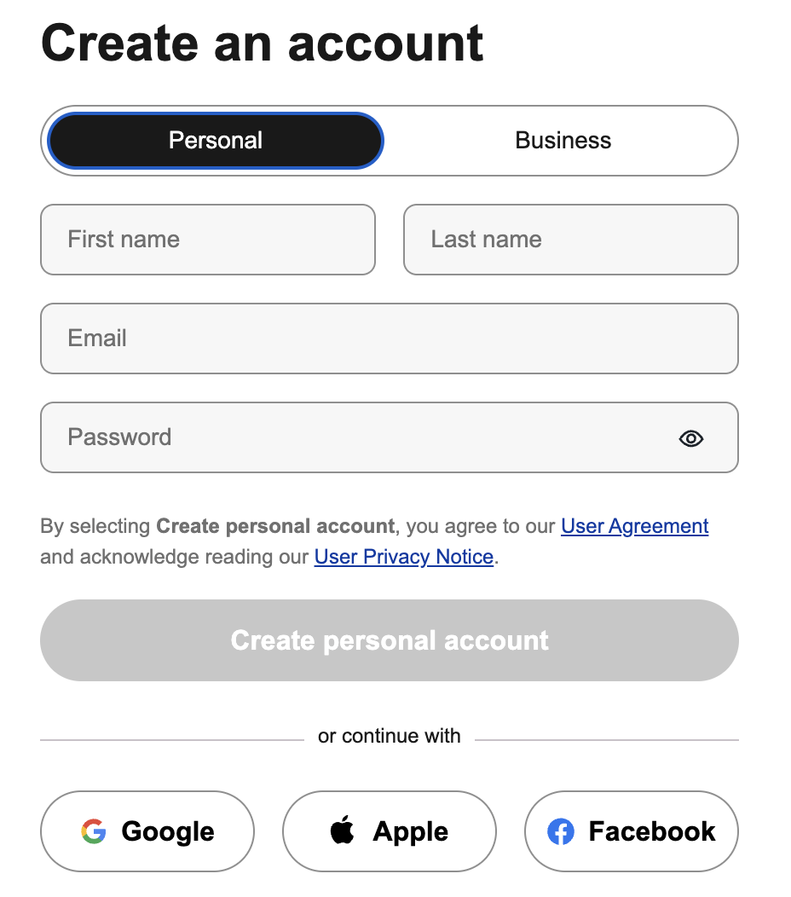

<!-- https://marpit.marp.app/directives -->

# My name is James Warner 👋
## Software development at instructor Indian Hills Community College in Iowa

---

# My town

---

# My family
---

# OAuth

---
# What is OAuth?

- Usually looks like this
- Short for "Open Authorization"
- A protocol for granting third-party websites/apps authorization to data
- Advantages for both users and developers
- An open standard for access to websites, apps, etc
  - Think 5G, USB-C, SQL, etc

---
# Why OAuth?

- Developed in mid 2000s
- A standard way to grant apps access to third-party APIs to enhance their application
- Secure, but 

---

# Find a website that is using OAuth 🕵️

How do you know it's using OAuth?
What third-party services do they use? 
What common elements do you notice on the registration/login page?

---
 **churchofjesuschrist.org** login

 - Is the church website using OAuth?
 - Why/why not?

---
 **familysearch.org**
 Now try familysearch.org
 Are they using OAuth? 
 What's different?

---
**familysearch.org**
 - Members can use OAuth to sign-in using FamilySearch
 - Non-members can create free FamilySearch accounts using Google, Facebook, etc (limited access)

 [developers.familysearch.org](https://developers.familysearch.org/main/docs/authentication)
 - FamilySearch OAuth 2.0 implementation

---
# OAuth 2.0 Flow

---

# Authorization servers
<!-- https://developer.okta.com/docs/concepts/auth-servers/?utm_source=google&utm_campaign=amer_mult_usa_all_wf-all_dg-ao_a-wf_search_google_text_kw_smb_utm2&utm_medium=cpc&utm_id=aNK4z000000UB9OGAW&gad_source=1&gad_campaignid=20762163115&gbraid=0AAAAACww3aHknHbg1iR5f5qGp1C1tB4Dy&gclid=CjwKCAjw04HIBhB8EiwA8jGNbe9Ri0m8TR0eNyZMyRMycK2l05-A4KEE6ruphQSs3I80PirOHuYsthoCmJYQAvD_BwE -->
Authorization servers sit between the client and the OAuth providers
 - provide session management
 - UI for logging in/out, registrating, updating account details, etc
 - captchas
 - duplicate email logic
 - Email verification (and other 2FA)
 - so much more 🙌

---

## pros/cons of OAuth

---

## Code it out

---

 # Clerk OAuth Example Setup
1. Create a free Clerk account
   - Use OAuth to sign-up 
2. Create an example app 
   - Enable email and at least one OAuth provider
3. Copy secrets to .env file in project
   - **Make sure .env's are added to .gitignore!**

---

# Clerk OAuth Example Setup

4. Create middleware.ts (proxy.ts) file and copy contents from Clerk documentation (if not already generated)
5. Wrap app in `ClerkProvider` to provide global access in the app to authentication

## Test!

Run the app locally and verify registration of chosen OAuth provider works by:
- Registering for an account (use OAuth provider first)
- Sign out and register email/password (try same email as OAuth provider account)

--- 

# Clerk Dashboard
- View your new users under your dashboard
  - Can you see their emails?
  - Can you see their passwords?
- View user object as JSON
  - This user object is available in your client app when user is logged in
  - What could you do with this information?

---

# Using OAuth authorization server to get user data

---

# Production considerations 

